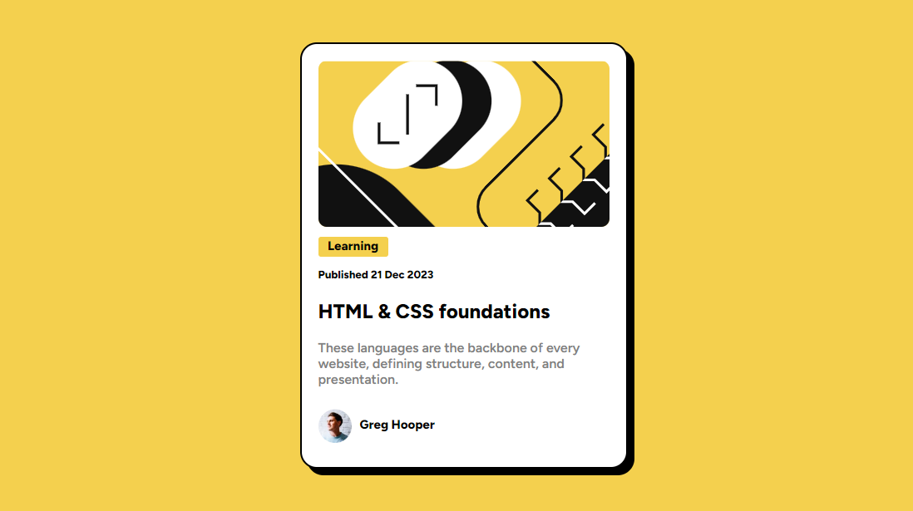

# Frontend Mentor - Blog preview card solution

This is a solution to the [Blog preview card challenge on Frontend Mentor](https://www.frontendmentor.io/challenges/blog-preview-card-ckPaj01IcS).

## Table of contents

- [Overview](#overview)
  - [The challenge](#the-challenge)
  - [Screenshot](#screenshot)
  - [Links](#links)
- [My process](#my-process)
  - [Built with](#built-with)
  - [What I learned](#what-i-learned)
  - [Continued development](#continued-development)
  - [Useful resources](#useful-resources)
- [Author](#author)

## Overview

### The challenge

The challenge is to build out this blog preview card and get it looking as close to the design as possible.
Users should be able to:

### Screenshot




### Links

- Solution URL: [Add solution URL here](https://your-solution-url.com)
- Live Site URL: (https://blog-card-project02.netlify.app/)

## My process

### Built with

- Semantic HTML5 markup
- CSS properties
- Flexbox
- CSS Grid

### What I learned

I learnt more about the <div> element.
I learnt about overflow.

some codes I found out about along the way:
```css
.round {
  overflow: hidden;
}
```
```css
.container {
  box-shadow: 8px 8px;
}
```

### Continued development

I want to work more on images and <div>s. I had little problems with them regarding size and height.

### Useful resources

- [Example resource 1](https://bootcamp.uxdesign.cc/5-simple-ways-to-center-a-div-horizontally-and-vertically-in-css-23bbaa5f9f52) - This helped me centralize my content, was somehow easier for me than flex.
- [Example resource 2](https://www.youtube.com/watch?v=EiNiSFIPIQE) - This is an amazing video, really helped me understand CSS grid better for when I wanted to adjust my footer.

## Author

- Website - [Aminah Hassan](https://www.your-site.com)
- Frontend Mentor - [@yourusername](https://www.frontendmentor.io/profile/yourusername)
- LinkedIn - [Aminah Hassan](https://www.linkedin.com/in/aminah-hassan-5895b319a/)


## Acknowledgments

Special thanks to Taslim Owolarafe for helping through this project.
